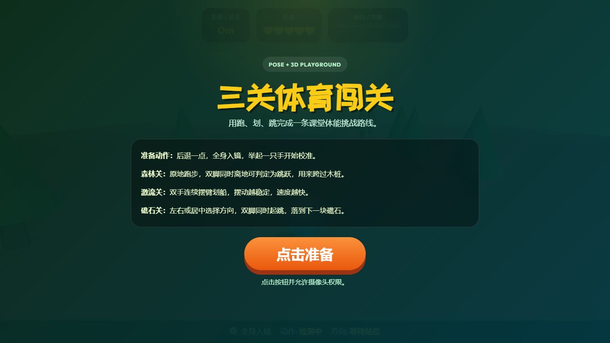
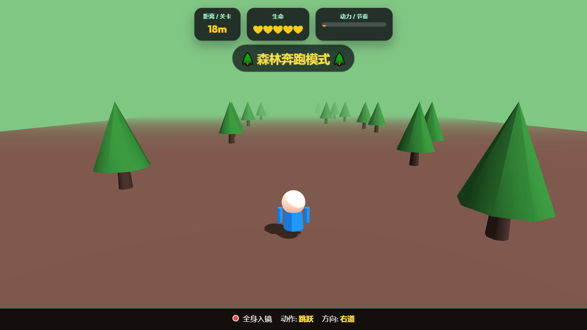
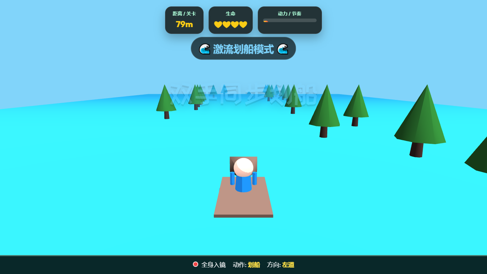
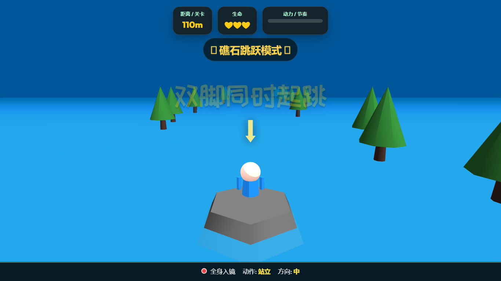

# AI PE Lab

`AI PE Lab` is a browser-first open playground for AI-enhanced physical education activities.

This repository focuses on a practical niche: turning full-body pose input into classroom-ready interactive experiences that can run in a browser with no native installation.

## Why This Repo Matters

- It explores how `MediaPipe Pose` can be used beyond demos and into real teaching interactions.
- It keeps deployment simple enough for teachers, workshops, and public demos.
- It treats each example as a reusable reference, not just a one-off experiment.

## Current Focus

The first polished example is:

- [Three-Stage Adventure Playground](./examples/three-stage-adventure/)

This example turns a student into the controller for a three-part activity:

- `0-50 m`: forest runner, dodge obstacles, jump over logs
- `50-100 m`: river rower, accelerate with arm motion
- `100 m+`: reef hopping, choose a lane and jump with both feet

## Design Principles

- Browser first: examples should run from static hosting such as GitHub Pages.
- Classroom friendly: interactions should be understandable in seconds.
- Open by default: code should be easy to inspect, remix, and adapt.
- Small moving parts: examples should stay lightweight enough for public review and contribution.

## Who This Repo Is For

- teachers experimenting with AI-assisted PE activities
- developers building pose-driven interaction patterns
- workshop facilitators who need zero-install browser demos
- open-source contributors interested in motion UX, educational tooling, and lightweight 3D experiences

## Quick Start

1. Clone or download the repository.
2. Serve it with any static file server.
3. Open the example path in a modern browser with camera permissions enabled.

If you use Node.js locally:

```bash
npx serve .
```

Then open:

```text
/examples/three-stage-adventure/
```

## Repository Layout

```text
ai-pe-lab/
  docs/
  examples/
    three-stage-adventure/
      index.html
      README.md
      src/
```

## What Is Already Here

- a modular browser example split into scene, pose, game, UI, and audio layers
- clean public-facing copy suitable for GitHub sharing
- static-host-friendly structure for GitHub Pages or any CDN
- documentation that explains the example and its intended direction

## Screenshots

<p align="center">
  
  
</p>
<p align="center">
  
  
</p>

## Maintainer Priorities

- improve pose classification quality for classroom movement patterns
- keep examples readable enough for first-time contributors
- add more small, remixable PE interaction demos
- document deployment and teaching use cases more clearly

## Roadmap

- add screenshots and a short demo video
- add score persistence and a lightweight result summary
- expose thresholds through a simple settings panel
- extract shared pose helpers for multiple examples
- add more mini-games under `examples/`

## Contributing

Contributions are welcome. Good starting areas include:

- mobile and tablet compatibility
- pose threshold tuning
- accessibility and clearer feedback states
- documentation, demos, and classroom deployment notes

See [CONTRIBUTING.md](./CONTRIBUTING.md) for a lightweight contribution workflow.

## License

This project is released under the [MIT License](./LICENSE).
